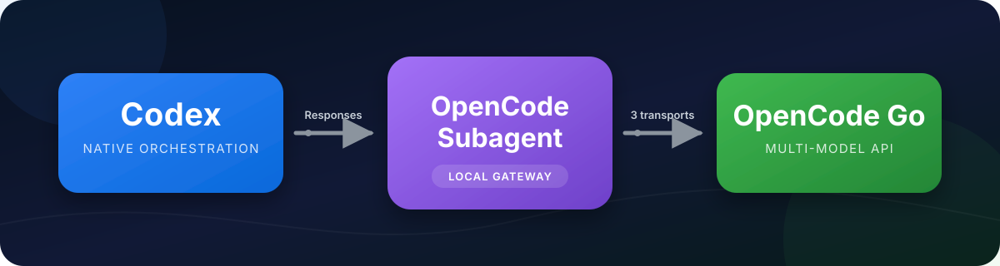

<p align="center">
  
</p>

<p align="center">
  <strong>简体中文</strong> · <a href="./README.en.md">English</a>
</p>

<!-- README_SYNC: 2026-08-14.1 -->
<!-- README.md and README.en.md are maintained as a synchronized pair. -->

# opencode_subagent

## 项目简介

为 Codex 接入 OpenCode Go API 的原生 `OpenCode` 子 Agent。项目提供 19 个模型、模型与 reasoning effort 切换，以及 Chat Completions、Responses、Anthropic Messages 三类 transport。

默认配置为：

```text
model=deepseek-v4-flash, effort=max
```

## 核心特性

- 原生调用：`spawn_agent(agent_type="OpenCode", fork_context=false, ...)`
- 支持 `chat_completions`、`responses`、`anthropic_messages`
- 本地兼容网关只监听 `127.0.0.1`
- API Key 只存入系统凭据库，不写入 README、配置、日志或命令参数
- 支持模型、effort 原子切换、失败回滚和显式模型目录刷新

## 快速开始

要求：Windows 或 macOS、Python 3.11+、Node.js/npm、Codex 桌面应用和 OpenCode Go API Key。

安装技能：

```bash
npx skills add Ran-sh/opencode_subagent -g -y
```

重启 Codex、打开新任务，然后说：

```text
使用 $codex-opencode-go-subagent 完成首次配置。
```

也可以直接配置：

```powershell
py -3 codex-opencode-go-subagent/scripts/codex_opencode_go.py setup --api-key-stdin --json
```

macOS 将 `py -3` 换成 `python3`。

## 默认配置

首次配置后应看到：

```text
model_provider = opencode-go
# selected profile: model=deepseek-v4-flash, effort=max
model = deepseek-v4-flash
reasoning_effort = max
agent_role = OpenCode
```

API Key 通过 stdin 输入，保存到 Windows Credential Manager 或 macOS Keychain。配置完成后请重启 Codex 并打开新任务。

## 切换模型

模型和 effort 必须同时提供：

```powershell
py -3 codex-opencode-go-subagent/scripts/codex_opencode_go.py profile list --json
py -3 codex-opencode-go-subagent/scripts/codex_opencode_go.py profile set --model gpt-5.6-luna --effort high --json
```

静态切换、不执行 live probe：

```powershell
py -3 codex-opencode-go-subagent/scripts/codex_opencode_go.py profile set --model qwen3.8-max --effort max --skip-live-test --json
```

## 原生子 Agent 调用

配置完成后，主 Agent 使用：

```text
spawn_agent(agent_type="OpenCode", fork_context=false, ...)
```

`OpenCode` 是纯文本与工具 Agent。图片、音频、视频和截图应先由主 Agent 检查，再把文字事实交给子 Agent。不要使用旧的 `DeepSeek` 角色、`codex exec` 或管理脚本冒充原生子 Agent。

## 详细文档

完整的模型目录、协议转换、工具调用、reasoning 状态、安全边界、管理命令、迁移回滚和验收方法见：

- [技术参考文档](docs/TECHNICAL_REFERENCE.md)
- [兼容性说明](codex-opencode-go-subagent/references/compatibility.md)
- [操作手册](codex-opencode-go-subagent/references/operations.md)
- [网关协议](codex-opencode-go-subagent/references/protocol.md)

中英文 README 使用相同的 `README_SYNC` 修订号。CI 会检查章节、关键命令、模型契约，并要求两份 README 在同一变更中更新。

## 许可证

本项目采用 [MIT 许可证](LICENSE)。旧参考基线、第三方来源和归属信息见 [NOTICE.md](NOTICE.md)。

本项目不是 OpenAI、OpenCode、DeepSeek 或其他模型提供方的官方项目，也未获得其背书。
