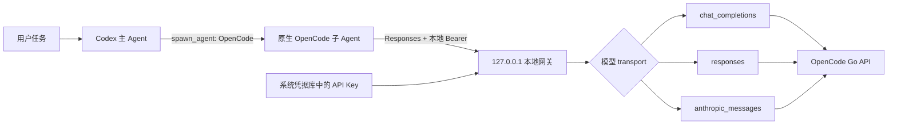

# opencode_subagent

由 **Ran-sh** 维护。

这是一套面向 Codex 桌面应用的 OpenCode Go 原生子 Agent 方案：它收录 19 个 OpenCode Go 模型的协议配置，并统一注册为原生角色 `OpenCode`。新安装的默认身份是 `OpenCode(deepseek-v4-flash_max)`，实际字段为 `model=deepseek-v4-flash`、`effort=max`；不会创建名为 `DeepSeek` 的角色。

日常调用形式是：

```text
spawn_agent(agent_type="OpenCode", fork_context=false, ...)
```

OpenCode 配置中的模型采用 `opencode-go/<model-id>` 格式；Codex 本地注册表和 Agent Profile 保留不带 Provider 前缀的 `<model-id>`。

## 五步快速开始

1. 安装技能：`npx skills add Ran-sh/opencode_subagent -g -y`。
2. 重启 Codex，然后打开一个新任务。
3. 在新任务中说：`使用 $codex-opencode-go-subagent 完成首次配置`。
4. 配置成功后确认角色为 `OpenCode`，默认 Profile 为 `model=deepseek-v4-flash, effort=max`。
5. 日常编码由主 Agent 调用 `spawn_agent(agent_type="OpenCode", fork_context=false, ...)`，不要再次运行配置脚本。

`spawn_agent(...)` 是 Codex 的 Agent 接口，不是终端命令。`fork_context=false` 表示子 Agent 不继承主对话历史，因此派发内容必须自包含。

## 主要功能

- 一个原生 `OpenCode` 角色使用统一的 19 模型目录，默认 Profile 为 `model=deepseek-v4-flash, effort=max`；
- 在 Codex Responses 协议与 OpenCode Go 的 `chat_completions`、`responses`、`anthropic_messages` 三类接口之间转换；
- 支持受支持工具的多轮调用与 Responses SSE 流式输出；
- 支持 Codex developer instructions，并过滤无法下发给普通模型的 hosted web search 声明；
- 模型与推理强度作为一组进行原子切换，失败时恢复模型目录、Agent 配置和管理清单；
- 显式刷新 OpenCode Go 模型目录，未知项或协议冲突仅报告，不会静默采用；
- API Key 只存入 Windows Credential Manager 或 macOS Keychain；本地网关仅监听 `127.0.0.1`；
- 兼容旧版 18 模型托管状态：只在内存补入 `minimax-m2.5`，不自动改写用户文件。

本仓库只包含配置技能、协议网关、测试和文档，不包含 `deepseek-dispatch-governor`，也不捆绑 API Key、私有日志或工作区标识。

## 架构



本地网关负责协议转换、工具调用往返、SSE 流式输出和 reasoning 句柄管理。主任务继续使用用户原来的 Codex 模型与登录方式，本技能不会修改顶层 `model` 或 `model_provider`。

因此，本项目不要求 CC Switch。`opencode-go` 只负责 `OpenCode` 子 Agent；如果 Codex 主任务的顶层 `model_provider` 被设置为某个第三方本地代理，那么只有主任务会继续依赖该代理。希望主任务直连官方 Codex 时，应将顶层 Provider 切回内置 `openai`，同时保留 `agents.OpenCode` 与 `model_providers.opencode-go`。

## 安装

要求：Windows 或 macOS、Python 3.11+、提供 `npx` 的 Node.js/npm 环境、ChatGPT/Codex 桌面应用，以及可用的 OpenCode Go API Key。

```bash
npx skills add Ran-sh/opencode_subagent -g -y
```

`-g` 安装到全局技能目录，`-y` 自动确认安装。安装完成后请重启 Codex，再打开新任务，使技能与 `OpenCode` 角色进入当前工具 schema。

## 首次配置

在新任务中说：

```text
使用 $codex-opencode-go-subagent 把 OpenCode Go 配置成 Codex 原生子 Agent。
```

技能会先运行只读状态检查；仅在缺少凭据时索要 API Key。API Key 通过标准输入传给管理器，再保存到系统凭据库，不会写入配置文件、命令参数、日志或临时文件。

也可以在克隆出的本仓库根目录直接运行管理器；全局安装用户优先使用上面的自然语言技能调用。Windows：

```powershell
py -3 codex-opencode-go-subagent/scripts/codex_opencode_go.py setup --api-key-stdin --json
```

macOS：

```bash
python3 codex-opencode-go-subagent/scripts/codex_opencode_go.py setup --api-key-stdin --json
```

静态配置成功时，默认 Profile 应为：

```text
model_provider = opencode-go
model = deepseek-v4-flash
reasoning_effort = max
agent_role = OpenCode
```

管理器的 `setup`、`repair` 和 `profile set` 默认执行本地网关 direct 探针，`test` 始终执行；`--skip-live-test` 可跳过前三者的 direct 探针。探针会联网请求真实模型，可能产生费用、耗时和限流，因此运行 `test --all-models` 前应特别确认。direct 探针不等于原生 Codex 派发验收；完整原生验收还应创建 `OpenCode` 子 Agent、检查子任务元数据，并确认验收口令。

## 日常编码派发

配置完成后，日常任务不需要重复运行技能或管理脚本。下面是主 Agent 内部使用的原生接口示意，不是让用户粘贴到终端的命令：

```text
spawn_agent(agent_type="OpenCode", fork_context=false, ...)
```

不要用 `DeepSeek` 角色、`codex exec` 或管理脚本冒充子 Agent。若当前工具 schema 中没有 `OpenCode`，请重启 Codex 或打开新任务。

`OpenCode` 是纯文本与工具 Agent。图片、音频、视频、截图和网页视觉内容应先由主 Agent 检查，再以文字事实交给子 Agent。完整支持范围集中列在“协议与安全边界”。

## 支持模型

当前冻结目录收录 19 个活跃模型的协议元数据，来源日期为 2026-08-13。目录收录和协议支持不表示每个账户都拥有全部模型权限，也不表示全部模型都已完成真实 API 验证。

| Transport | 数量 | 模型 ID |
|:---|---:|:---|
| `chat_completions` | 11 | `deepseek-v4-flash`、`deepseek-v4-pro`、`glm-5.1`、`glm-5.2`、`grok-4.5`、`hy3`、`kimi-k2.6`、`kimi-k2.7-code`、`kimi-k3`、`mimo-v2.5`、`mimo-v2.5-pro` |
| `responses` | 1 | `gpt-5.6-luna` |
| `anthropic_messages` | 7 | `minimax-m2.5`、`minimax-m2.7`、`minimax-m3`、`qwen3.6-plus`、`qwen3.7-max`、`qwen3.7-plus`、`qwen3.8-max` |

每个模型允许的 effort、默认档位与 transport 映射见 [兼容性说明](codex-opencode-go-subagent/references/compatibility.md)。`default` 是不向上游发送思考强度的伪档位；effort 只是请求参数，不承诺速度、价格或服务端实际推理资源。`profile set --model` 使用不带 `opencode-go/` 前缀的模型 ID。

## 模型与思考档位切换

模型和 effort 必须同时提供。Windows 示例：

```powershell
# 查看全部模型 × effort 组合
py -3 codex-opencode-go-subagent/scripts/codex_opencode_go.py profile list --json

# 查看当前 Profile
py -3 codex-opencode-go-subagent/scripts/codex_opencode_go.py profile show --json

# 原子切换，并默认执行静态检查与本地网关 direct 探针
py -3 codex-opencode-go-subagent/scripts/codex_opencode_go.py profile set --model gpt-5.6-luna --effort high --json

# 只做静态切换，稍后再手动验收
py -3 codex-opencode-go-subagent/scripts/codex_opencode_go.py profile set --model qwen3.8-max --effort max --skip-live-test --json
```

macOS 将 `py -3` 换为 `python3`。重复设置当前组合不会写文件或创建备份，但默认仍会执行 direct 探针。真正切换成功后应重启 Codex 并打开新任务，让新的 Agent Profile 进入工具 schema。

> 注意：direct 探针会访问真实 OpenCode Go API；`test --all-models` 会依次请求目录中的全部模型，可能产生费用、耗时、限流或模型权限错误。

## 管理命令

```text
python3 codex-opencode-go-subagent/scripts/codex_opencode_go.py <command> --json
```

Windows 使用 `py -3`。稳定命令包括：

| 命令 | 作用 |
|:---|:---|
| `status` | 只读检查配置、模型目录、凭据、网关和受管文件哈希 |
| `setup` | 首次配置并默认执行 direct 探针 |
| `test [--all-models]` | 测试当前 Profile，或按默认 effort 测试全部 19 模型 |
| `repair` | 按当前合法 OpenCode Profile 重建受管配置并验收 |
| `profile list/show/set` | 列出、查看或原子切换模型与 effort |
| `models list/refresh` | 只读列出模型，或显式事务刷新模型目录 |
| `gateway status/start/stop` | 查询、启动或停止本地网关 |
| `disable` | 停用角色，保留 Provider、目录、状态和 API Key |
| `uninstall` | 移除受管配置；仅显式传入 `--remove-credential` 才删除 API Key |

完整参数、状态码、事务顺序、回滚与排障见 [操作手册](codex-opencode-go-subagent/references/operations.md)。

## 协议与安全边界

| 支持 | 不支持 |
|:---|:---|
| 文本、shell、apply_patch、普通 function、custom 工具、MCP 工具 | 图片、音频、hosted web、图像生成、computer-use |

- 网关只允许绑定 `127.0.0.1`，模型请求和关闭端点都要求本地 Bearer token；
- 请求体上限 32 MiB，并发上限 8，连接超时 30 秒，流式空闲超时 650 秒；
- reasoning 原文只保存在网关内存中，通过随机句柄引用：2048 条 LRU、2 小时 TTL，不落盘；
- 日志只允许 model、transport、status、duration_ms 和脱敏 request ID，不记录请求正文、响应正文或凭据；
- 网关不注册系统开机启动，也不作为系统服务安装；认证 helper 在需要 token 时复用同一启动机制按需拉起网关，用户也可通过 `gateway start|stop` 显式管理；
- 托管文件出现哈希漂移时返回 `conflict`，不会静默覆盖用户修改。

协议端点、SSE 事件、工具映射和 reasoning 生命周期见 [网关协议](codex-opencode-go-subagent/references/protocol.md)。

## 验证

仓库自动化验证：

```bash
python -B -m unittest discover -s tests -v
python -B scripts/quick_validate.py codex-opencode-go-subagent --repo-root .
```

证据必须分层理解：

- 单元测试与静态验证证明代码契约和仓库结构；
- manager direct 探针证明本地网关能够完成文本与 function-tool 往返；
- 原生 gate 还必须使用 `spawn_agent(agent_type="OpenCode", fork_context=false, ...)`，并核对子任务的 Provider、模型、effort 与 `agent_role=OpenCode`；
- 真实 OpenCode Go 服务、全部模型和 macOS 环境不能由较低层级测试替代。

验证状态应按层级理解：

| 范围 | 平台 | 证据 | 状态 |
|:---|:---|:---|:---|
| 仓库代码与静态结构 | Windows | 137 项单元测试、quick_validate | 已通过 |
| `model=deepseek-v4-flash, effort=max` | Windows | 正式托管网关原生 `OpenCode` 派发、SQLite 元数据 | 已通过 |
| 其余模型和代表 Profile | — | 真实 OpenCode Go API、原生 gate | 待逐项验证 |
| macOS | macOS | 系统凭据、网关与原生派发真机测试 | 待验证 |

参考文档的旧发布清单仍把原生 gate 写为待执行；以上表格记录的是本仓库随后在 2026-08-13 完成的实际 Windows 验收。后续发布应同步更新操作手册，避免状态说明再次分叉。

## 数据来源

- [OpenCode Go 文档](https://opencode.ai/docs/zh-cn/go/)
- [OpenCode 模型配置](https://opencode.ai/docs/config/#models)
- [OpenCode Zen](https://opencode.ai/docs/zh-cn/zen/)
- [models.dev](https://models.dev/)
- [参考项目 Ran-sh/codex_subagent_deepseek](https://github.com/Ran-sh/codex_subagent_deepseek)

## 致谢、商标与许可

本仓库以 [Ran-sh/codex_subagent_deepseek@84458a2](https://github.com/Ran-sh/codex_subagent_deepseek/tree/84458a2ca16522e8685e6ba18468c6608cd8f1d1) 为旧参考基线，并保留 oil-oil 与 Ran-sh 的归属。具体继承范围和本仓库新增实现见 [第三方来源与归属说明](NOTICE.md)。

第三方名称及标识仅用于说明兼容性；相关商标归各自权利人所有。本项目不是 OpenAI、Anomaly、DeepSeek 或其他模型提供方的官方项目，也未获得其背书。

本项目采用 [MIT 许可证](LICENSE)。使用、修改和再发布时须遵守许可证中的版权与许可保留要求。
